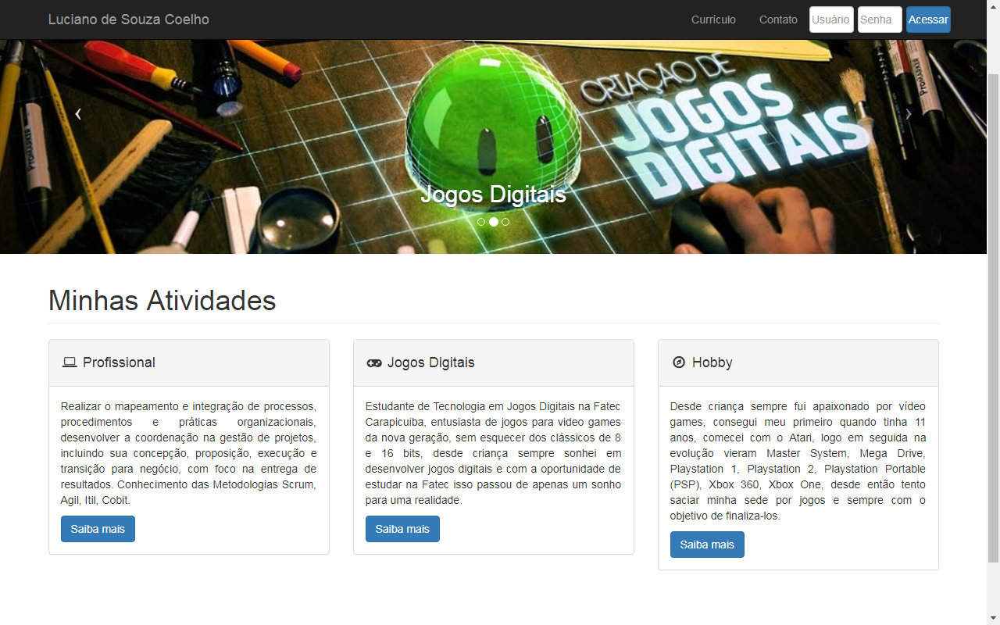

<h4 align="center">
  🚀 Site Jogos Digitais - Luciano Coelho - Fatec
</h4>

  

  
  
  

  

  

  <a href="#-tecnologias">Tecnologias</a>&nbsp;&nbsp;&nbsp;|&nbsp;&nbsp;&nbsp;
  <a href="#-projeto">Projeto</a>&nbsp;&nbsp;&nbsp;|&nbsp;&nbsp;&nbsp;
  <a href="#-layout">Layout</a>&nbsp;&nbsp;&nbsp;|&nbsp;&nbsp;&nbsp;
  <a href="#memo-licença">Licença</a>

 

Pode acessar a pagina por <a href='https://lucianocoelho-28.github.io/SiteLSC/'> Aqui</a>

  

## 🚀 Tecnologias

Esse projeto foi desenvolvido com as seguintes tecnologias:

- HTML
- CSS
- JavaScript
- Bootstrap 
- PHP

Bibliotecas

- [Google Fonts](https://fonts.google.com/)
- [SwipeJS](https://github.com/nolimits4web/Swiper)
- [ScrollRevel](https://scrollrevealjs.org)

Utilitários

- [randomuser.me](https://randomuser.me/photos)
- [IconMoon](https://icomoon.io/app/#/select)

## 💻 Projeto

Este Website foi implementado para divulgar os trabalhos desenvolvidos na grade curricular da Faculdade de Tecnologia de Carapicuiba (FATEC) utilizando HTML 5, CSS, Javascript, Bootstrap e PHP. Para avaliação do desenvolvimento efetue o download código fonte do site no botão abaixo.

## 🔖 Layout

1. raiz: encontram-se os arquivos .php, páginas html e o script de banco de dados (.sql) utilizado no projeto
1. css: arquivos do bootstrap e template do site (morden-bussiness.css)
1. download: pasta com os arquivos de projetos compactados. Incluindo o código fonte do projeto do Site
1. font-awsome: neste diretório encontram fontes, arquivos .less e .scss (aceleradores de desenvolvimento CSS)
1. fonts: demais fontes utilizadas no projeto
1. images: diretório de imagens do site
1. js: arquivos javascript do projeto, arquivo padrões de configuração do jquery e bootstrap 

## :memo: Licença

Esse projeto está sob a licença MIT. Veja o arquivo [LICENSE](LICENSE) para mais detalhes.

---

